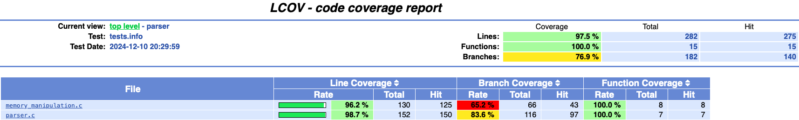
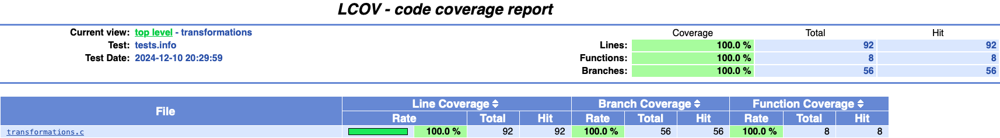

# 3DViewer v1.0

Реализация на языке программирования С программы для просмотра 3D-моделей в каркасном виде (3D Viewer). Сами модели загружаются из файлов формата .obj. Программа позволяет просматривать их на экране с возможностью вращения, масштабирования и перемещения.


## Contents

1. [Спецификация](#спецификация)
2. [Сборка](#сборка)
3. [Юнит тесты](#юнит-тесты)
4. [LCOV report](#lcov-report)
5. [Документация](#документация)
6. [Создание дистрибутива](#создание-дистрибутива)
7. [Авторы проекта](#авторы-проекта)

## Спецификация

- Программа разработана на языке С стандарта C11 с использованием компилятора gcc. Допустимо использование дополнительных библиотек и модулей QT;
- Сборка программы должна быть настроена с помощью Makefile со стандартным набором целей для GNU-программ: all, install, uninstall, clean, dvi, dist, tests, gcov_report. Установка должна вестись в любой другой произвольный каталог;
- Программа должна быть разработана в соответствии с принципами структурного программирования;
- Должно быть обеспечено покрытие unit-тестами модулей, связанных с загрузкой моделей и аффинными преобразованиями;
- В один момент времени должна быть только одна модель на экране;
- Программа должна предоставлять возможность:
    - Загружать каркасную модель из файла формата obj (поддержка только списка вершин и поверхностей);
    - Перемещать модель на заданное расстояние относительно осей X, Y, Z;
    - Поворачивать модель на заданный угол относительно своих осей X, Y, Z;
    - Масштабировать модель на заданное значение;
- В программе должен быть реализован графический пользовательский интерфейс, на базе любой GUI-библиотеки с API для C89/C99/C11 <br/>
  * For Linix: GTK+, CEF, Qt;<br/>
  * For Mac: GTK+, Nuklear, raygui, microui, libagar, libui, IUP, LCUI, CEF, Qt;
- Графический пользовательский интерфейс должен содержать:
    - Кнопку для выбора файла с моделью и поле для вывода его названия;
    - Зону визуализации каркасной модели;
    - Кнопку/кнопки и поля ввода для перемещения модели;
    - Кнопку/кнопки и поля ввода для поворота модели;
    - Кнопку/кнопки и поля ввода для масштабирования модели;  
    - Информацию о загруженной модели — название файла, кол-во вершин и ребер;
- Программа должна корректно обрабатывать и позволять пользователю просматривать модели с деталями до 100, 1000, 10 000, 100 000, 1 000 000 вершин без зависания (зависание — это бездействие интерфейса более 0,5 секунды).
 - Программа должна позволять настраивать тип проекции (параллельная и центральная);
 - Программа должна позволять настраивать тип (сплошная, штриховая), цвет и толщину ребер, способ отображения (отсутствует, круг, квадрат), цвет и размер вершин;
 - Программа должна позволять выбирать цвет фона;
 - Настройки должны сохраняться между перезапусками программы.
 - Программа должна позволять сохранять полученные («отрендеренные») изображения в файл в форматах bmp и jpeg;
 - Программа должна позволять по специальной кнопке записывать небольшие «скринкасты» — текущие пользовательские аффинные преобразования загруженного объекта в gif-анимацию (640x480, 10fps, 5s).

## Сборка

- перейдите в `src`
- запустите команду `make install`

## Юнит тесты

тесты на афинные преобразования

- перейдите в `src`
- запустите команду `make tests`

```bash
running tests...

Running suite(s): test_parser
100%: Checks: 13, Failures: 0, Errors: 0

Running suite(s): test_scale
100%: Checks: 9, Failures: 0, Errors: 0

Running suite(s): test_move
100%: Checks: 21, Failures: 0, Errors: 0

Running suite(s): test_rotate
100%: Checks: 23, Failures: 0, Errors: 0

Running suite(s):100%: Checks: 0, Failures: 0, Errors: 0

Total: 66
Failed: 0
Passed: 66
```

## LCOV report

- перейдите в `src`
- запустите `make gcov_report`




## Документация

- перейдите в `src`
- сгенерируйте документацию командой `make dvi`

## Создание дистрибутива

- перейдите в `src`
- создайте дистрибутив командой `make dist`

дистрибутив сохранится в `src/distribution`

## Авторы проекта

S21 никнеймы

- donnapoc (Святослав)
- yuccierh (Никита)
- dobberpe (Лиза)
